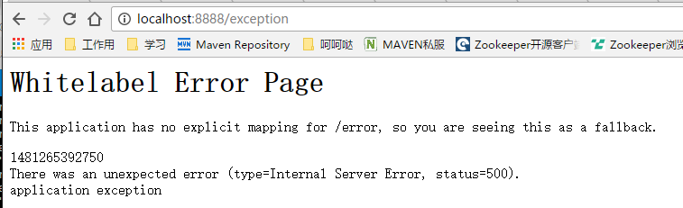

# errorHandle 全局统一异常处理

## 使用手册

1 引入pom

    ...
    <properties>
      ...
      <java.version>1.8</java.version>
      <spring-boot.version>1.4.1.RELEASE</spring-boot.version>
      <oss-release.version>1.0.6-SNAPSHOT</oss-release.version>
    </properties>
      ... 
    <!-- oss 依赖 -->
    <dependencyManagement>
      <dependencies>
        <dependency>
          <groupId>com.yirendai.oss</groupId>
          <artifactId>oss-release-spring-boot-${spring-boot.version}</artifactId>
          <version>${oss-release.version}</version>
          <type>pom</type>
          <scope>import</scope>
        </dependency>
      </dependencies>
    </dependencyManagement>

    <dependecies>
      ...
      <!--errorhandle-->
      <dependency>
        <groupId>com.yirendai.oss.lib</groupId>
        <artifactId>oss-lib-errorhandle-spring-boot-${spring-boot.version}</artifactId>
      </dependency>      
      ...
    </dependecies>

2 配置 application.yml

    server:
      port: 8080
      error:
        includeStacktrace: ALWAYS #统一异常处理是否启用调用栈跟踪 ALWAYS 总是启用 ,NEVER 不启用 ,ON_TRACE_PARAM 当请求包含trace参数名的时候跟踪

    app:       # oss app配置
      type: MIXED    # app类型 MIXED,RESTFUL,TEMPLATE 三种
      error:
        searchStrategy: HIERARCHY_FIRST # ORDER_FIRST, HIERARCHY_FIRST 自定义异常模板信息替换策略 默认HIERARCHY_FIRST
        handlerEnabled: false  #统一异常处理默认配置 若为true 则启用@ControllerAdvice方式处理异常

3 新建Application.java启动类

    @RestController
    @SpringBootApplication
    public class Application {

      @RequestMapping("/hi")
      public String sayHi() {
        return "HI Hello World!";
      }

      public static void main(String[] args) {
        SpringApplication.run(Application.class, args);
      }
    }  

4 现在即可使用了，运行Application的main方法

访问一个不存在的页面 http://127.0.0.1:8080:8080/exception 会出现下图所示

    
5 自定义错误页面

 在 src/main/resources/templates 目录下添加 error.html ，结果如图
 
 
6 使用http请求工具模拟访问restful请求结果示例（header中accept:application/json）
 
 
 
 返回json结果具体如下图
 
 
    
7 简单层面来说，恭喜你 oss-lib-errorhandle引入成功了!
 
8 更为详细的细节介绍，以及使用请查看文档[详细介绍文档](INTRODUCTION_DETAIL.html) 
