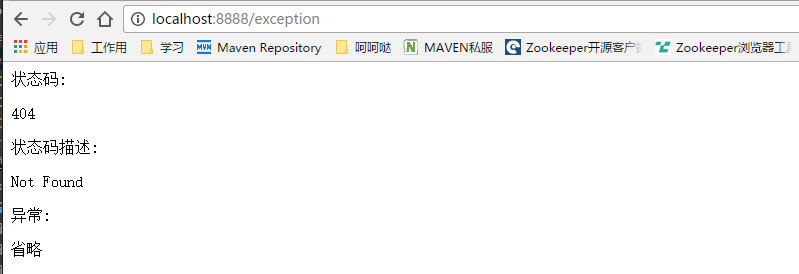

# errorHandle 详细介绍以及使用方式举例

## 统一的异常结构

  ResolvedError 属性如下：
   
  |名称|含义|例子|
  |---|---|---|---|
  |timestamp|时间戳|1481270674384|
  |status|http code| 404|
  |error|http code 对应错误信息| "Not Found"|
  |exception|异常|java.io.IOException|
  |message|异常描述信息|an I/O exception of some sort has occurred|
  |trace|异常堆栈信息|...|
  |errors|jsr303验证不通过|[{"field":"name","rejected":"&&&&&***","message":"名字字段不能包含特殊字符"}]|
  |path|当前请求路径|/exception|
  |datetime|时间(ISO8861)更加可观|2016-12-09T16:04:34.438+0800|
  |headers|异常头部信息|[{"name":"RESOLVED-ERROR","values":["RESOLVED-ERROR"]}]|
  |localizedMessage|异常本地化信息(重要 可作为页面错误展示用)|输入输出异常|
  |tracks|请求堆栈(可设置开关)|["curl  -H 'Accept: text/html,application/xhtml+xml,application/xml;q=0.9,image/webp,*/*;q=0.8' -X GET http://some-service:8080/exception"]|
   
## 支持restful, template, mixed三种应用.

>
对于template应用，用户可以自定义错误页，并且错误页只用一个更精简更好管理。
对于mixed应用，根据请求自动决定使用错误页或Restful错误信息。
对于restful错误信息 使用内容协商确定返回JSON或XML。

上面这三点已经在简单示例介绍中有所演示。***配置*** 为 app.type: XX  # MIXED,RESTFUL,TEMPLATE 三种 

### 错误页详细介绍

1 统一的一个错误页面所有错误都会定向到这个页面 /src/main/resources/templates/error.html,在这个页面可以做美化，根据http code做跳转之类的操作等等

2 在页面可以拿到统一已解析异常ResolvedError所有属性（也可直接取这个对象），可以从里面取出感兴趣的内容进行展示。

  thymeleaf代码示例
  
    <!DOCTYPE html>
      <html lang="en" xmlns:th="http://www.thymeleaf.org">
      <head>
          <title>Title</title>
      </head>
      <body>
      状态码:     

      状态码描述: 

      异常:       

      省略
      </body>
    </html>
  
  效果如下：
  
  
## restful详细介绍  

所有异常返回均为以下结构体即统一异常结构：(jsr303 验证需要前端做一些工作 //TODO)

    {
      "timestamp": 1481283168282,
      "status": 404,
      "error": "Not Found",
      "message": "Not Found",
      "path": "/exception",
      "datetime": "2016-12-09T19:32:48.282+0800",
      "errors":null  //--- 在验证不通过的情况下会有
      "headers":[
        {
          "name": "RESOLVED-ERROR",
          "values":[
            "RESOLVED-ERROR"
          ]
        }
      ],
      "localizedMessage": "null",
      "tracks":[
         "/exception"
      ]
    }

  
## 主动抛出异常

使用 com.yirendai.oss.lib.errorhandle.api.ApplicationExceptions

-   public static void checkArgument( //
        final boolean expression, // 判断参数
        final String format, final Object... arguments // 信息模板 ，参数
    示例：   checkArgument("param"==null,"参数不能为null 您输入的是{}"，"param") 

-   public static &lt;T&gt; T checkNotNull( //
        final T object, //  //判断null
        final HttpStatus status, final String format, final Object... arguments //
    示例：

-   public static void check( // 更自由的检查 可自定义http code 
       final boolean expression, //
       final HttpStatus status, final String format, final Object... arguments //
    示例：
       
-   public static ApplicationException wrap( //包装原生异常为我们的异常 需要自己抛
       final Throwable throwable, //
       final HttpStatus status, final String format, final Object... arguments // 
    示例：
      
-   public static ApplicationException applicationException( // 直接
       final HttpStatus status, final String format, final Object... arguments //  
    示例：throw ...
                   
## 自定义异常展示信息
                   
一些常见异常，我们提供的默认的本地化信息 如： 

    java.io.FileNotFoundException.status=500
    java.io.FileNotFoundException.template=文件未找到异常

若是想自定义的异常显示信息，配置也很简单：只需要在 src/main/resources/errorhandle 目录下增加命名为 application 的i18n properties配置，按照下面的格式填写即可。

 - 例子：
     java.io.FileNotFoundException.status=500
     java.io.FileNotFoundException.template=很抱歉 文件没有找到
 
 - 带el表达式的：
     java.io.FileNotFoundException.status=500
     java.io.FileNotFoundException.template=很抱歉 文件没有找到 异常信息 #{ex.message}
 
注意： 可以配置覆盖策略 application.yml中

    app.error.searchStrategy = HIERARCHY_FIRST # ORDER_FIRST, HIERARCHY_FIRST 自定义异常模板信息替换策略 默认HIERARCHY_FIRST
 
## 前端配合表单验证 //TODO
 
 表单验证格式
 
     "errors":[
        {
            "field": "age",
            "rejected": 12222,
            "message": "年龄不超过100岁"
        },
        {
            "field": "name",
            "rejected": "showexample",
            "message": "姓名必须是邮箱格式"
        }
     ]
 
 
 
 前端可怎么使用 
 
 当http code为422时，errors 不为null且数据结构如上图，则前端可根据这个基础做一个表单验证框架
 
## 前端提示信息 直接使用 localiedMessage 即可
 
  情景描述：异常对开发来说认识，但是对用户来说是个灾难，所有我们增加了一层本地化转译异常信息的概念，当发生异常时，向用户提供经过转译的信息，能使用户快速明白异常或异常的原因
    
   
  xxx 待补充
   
## 凡是想给前端我们这个统一的信息时 直接抛异常告诉我们 xxx 待美化语言
   
   正常业务，可以直接使用我们提供的检验参数的方法，主动的抛出异常，并且异常信息的localiedMessage是可定制的，这样就可以更灵活的与用户交互
   
   
## 待添加  
   

   
   
 
 

                  
