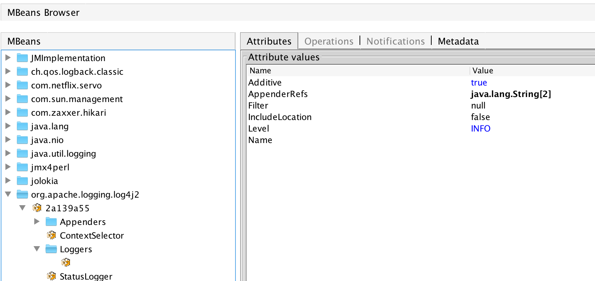
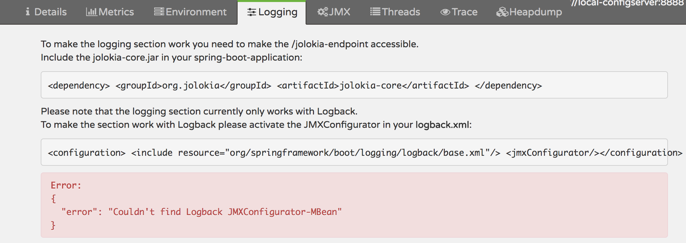
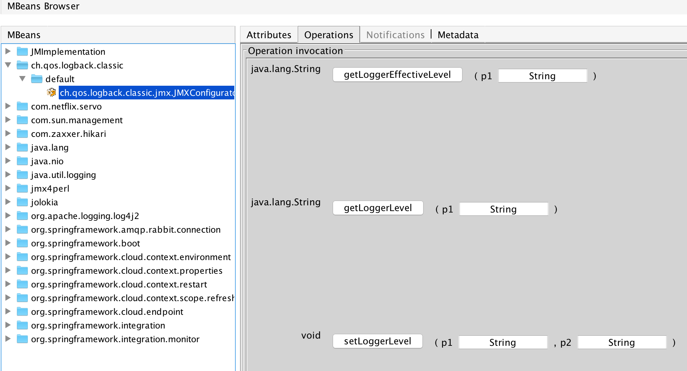
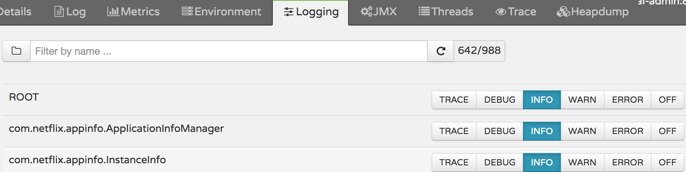

# oss-lib-log4j2

## spring boot 中使用log4j2存在的问题  
### 1. 在jmx中无法管理任意logger的等级  

通常情况下一个项目对应的logger包含两类，一类是在配置中显式声明的logger，另一类是在配置中没有明确声明但却真实存在的logger（其属性通过logger的继承关系来获得）。log4j2的JMX只能管理在配置中显式声明的logger，而忽略掉大量隐性声明的logger，这明显不符合运营需求。  
如图例所示：由于该项目只配置了1个logger，故JMX中只显示1个logger，也只能管理这一个logger。
### 2、无法通过Spring Boot Admin可视化管理log4j2中logger的等级(Spring Boot Admin目前只支持logback)  
   

## 扩展功能
针对上述问题进行修改，修改后的表现如下  
1、可以查看和修改任意logger

2、通过Spring Boot Admin可视化管理log4j2中logger

## 设计理念  
第一个问题的设计比较容易想到，这儿不做过多解释。  
重点阐述第二点。spring boot admin可视化管理logback的原理：用户点击按钮时发送HTTP指令给jolokia，jolokia调用MBean进行处理。也就是说只需要在log4j2的应用中创建一个相应的MBean就能实现对应的功能了。结合扩展功能中的第一张图，可以看到MBean的名字为ch.qos.logback.classic.jmx.JMXConfigurator，就是这个道理了。

## 使用指南
### 1、仅仅扩展JMX功能
  引入lib log4j2扩展的依赖即可。 
  
      <!-- 引入lib log4j2扩展  -->
      <dependency>
              <groupId>com.yirendai.oss.lib</groupId>
              <artifactId>oss-lib-log4j2-spring-boot-${spring-boot.version}</artifactId>
              <scope>runtime</scope>
      </dependency>   

### 2、通过Spring Boot Admin管理工程中的log4j2

具体引入配置如下：  

    <!-- 引入依赖管理 -->
    <dependencyManagement>
      <dependencies>
       <dependency>
         <groupId>com.yirendai.oss</groupId>
         <artifactId>oss-release-spring-boot-${spring-boot.version}</artifactId>
         <version>${oss-release.version}</version>
         <type>pom</type>
         <scope>import</scope>
       </dependency>
      </dependencies>
    </dependencyManagement>

    <!-- spring boot admin 管理需要 -->
    <dependency>
      <groupId>com.yirendai.oss.lib</groupId>
      <artifactId>oss-lib-adminclient-spring-boot-${spring-boot.version}</artifactId>
      <scope>runtime</scope>
    </dependency>
    
    <!-- spring boot admin server 通过jolokia调用JMX --->
    <dependency>
            <groupId>org.jolokia</groupId>
            <artifactId>jolokia-core</artifactId>
    </dependency>
    
    <!-- 引入lib log4j2扩展  -->
    <dependency>
            <groupId>com.yirendai.oss.lib</groupId>
            <artifactId>oss-lib-log4j2-spring-boot-${spring-boot.version}</artifactId>
            <scope>runtime</scope>
    </dependency>
